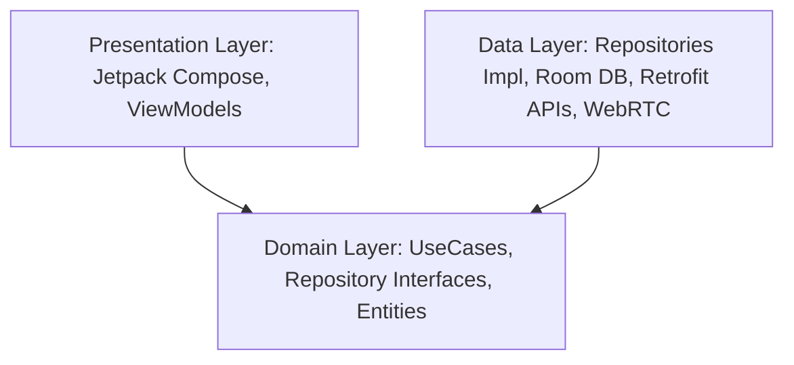

# SecureChat - Ứng dụng Trò chuyện Bảo mật & Gọi Video Real-time

SecureChat là một ứng dụng Android nhắn tin thời gian thực (Real-time Messaging) và gọi video ngang hàng (P2P Video Calling) chất lượng cao. Dự án được phát triển theo mô hình **Clean Architecture** kết hợp mẫu thiết kế **MVVM (Model-View-ViewModel)**, sử dụng bộ công cụ giao diện hiện đại **Jetpack Compose** cùng các công nghệ phát triển Android tiên tiến nhất hiện nay.

---

## 🌟 Tính năng Nổi bật

### 1. Xác thực & Quản lý Phiên làm việc (Authentication)
*   **Đăng nhập & Đăng ký**: Hỗ trợ đăng nhập và đăng ký tài khoản bảo mật thông qua Firebase Authentication.
*   **Lưu trữ ngoại tuyến**: Tự động lưu cache thông tin định danh và Session Token thông qua hệ thống quản lý mã hóa nội bộ giúp người dùng không phải đăng nhập lại.

### 2. Nhắn tin Nhóm & Cá nhân thời gian thực (Real-time Messaging)
*   **Real-time Synchronization**: Tin nhắn được gửi nhận tức thời thông qua Firebase Realtime Database / WebSocket.
*   **Offline Caching**: Toàn bộ lịch sử trò chuyện được tự động lưu xuống **Room Database** (SQLite ngoại tuyến). Người dùng vẫn có thể xem lại tin nhắn cũ mượt mà ngay cả khi thiết bị mất kết nối internet.
*   **Lazy Dynamic List**: Danh sách tin nhắn tối ưu hiệu năng tải ảnh đại diện và tự động cuộn (Auto-Scroll) khi có tin nhắn mới.

### 3. Gọi Video & Âm thanh Ngang hàng (WebRTC)
*   **Kết nối P2P**: Thiết lập luồng truyền video và audio độ trễ cực thấp sử dụng giao thức WebRTC (thông qua Stream WebRTC Android SDK).
*   **Đàm phán Tín hiệu (Signaling)**: Tự động trao đổi SDP Offers, Answers, và ICE Candidates thông qua Firebase Signaling Server.
*   **Điều khiển Cuộc gọi**:
    *   Bật/Tắt Microphone (Mute/Unmute).
    *   Bật/Tắt Camera (Video/Audio only).
    *   Đảo camera trước/sau (Flip Camera).
*   **Giao diện Cuộc gọi Chuyên nghiệp**: Hiển thị song song luồng video của đối phương (Remote Track - toàn màn hình) và luồng video cá nhân (Local Track - dạng cửa sổ nổi nhỏ ở góc).

### 4. Thông báo Đẩy thông minh (FCM Push Notifications)
*   **Wake-up Service**: Tích hợp **Firebase Cloud Messaging (FCM)**. Khi có cuộc gọi đến, một FCM Data Payload được đẩy tới thiết bị để đánh thức ứng dụng đang chạy ngầm hoặc đang tắt.
*   **Màn hình Cuộc gọi Khẩn cấp**: Hiển thị một Notification dạng **Call Priority (Category Call)** với độ ưu tiên tối đa, cho phép rung, chuông và ấn nút Chấp nhận/Từ chối trực tiếp từ màn hình khóa.

---

## 🏗️ Kiến trúc Dự án (Clean Architecture & MVVM)

Dự án tuân thủ nghiêm ngặt nguyên lý Clean Architecture để đảm bảo khả năng mở rộng, dễ dàng bảo trì và viết Unit Test:



### Chi tiết các lớp (Layers)
1.  **Domain Layer (Lớp Nghiệp vụ chính)**:
    *   Hoàn toàn độc lập với Android Framework hay bất cứ thư viện bên thứ 3 nào.
    *   Chứa các thực thể dữ liệu gốc (`User`, `Message`, `Conversation`).
    *   Các nghiệp vụ được chia nhỏ thành các **UseCases** đơn nhiệm (`LoginUseCase`, `SendMessageUseCase`, `GetConversationsUseCase`...) để tránh phình to logic ở ViewModels.
2.  **Data Layer (Lớp Dữ liệu)**:
    *   Chịu trách nhiệm lấy/ghi dữ liệu từ Network (Retrofit, Firebase) và Database nội bộ (Room).
    *   Triển khai chi tiết các Repository Interfaces được định nghĩa ở lớp Domain.
    *   Quản lý bộ nhớ đệm (Caching Strategy): Lưu Room DB khi có dữ liệu mạng mới và trả dữ liệu đệm khi offline.
3.  **Presentation Layer (Lớp Giao diện)**:
    *   Sử dụng **Jetpack Compose** để dựng UI dạng khai báo (Declarative UI) mượt mà và trực quan.
    *   Quản lý và cập nhật trạng thái UI thông qua `StateFlow` trong các `ViewModel` đã được tiêm phụ thuộc bằng **Dagger Hilt**.

---

## 🛠️ Công nghệ & Thư viện sử dụng (Tech Stack)

*   **Ngôn ngữ**: Kotlin (phiên bản mới nhất tương thích Kotlin 2.x).
*   **UI Framework**: Jetpack Compose & Material Design 3.
*   **Dependency Injection**: Dagger Hilt (phiên bản `@HiltViewModel`).
*   **Asynchronous & Reactive**: Kotlin Coroutines & Flow.
*   **Database ngoại tuyến**: Room Database (ORM SQLite).
*   **WebRTC**: Stream WebRTC Android SDK.
*   **Firebase Suite**:
    *   Firebase Auth (Xác thực).
    *   Firebase Realtime Database (Tín hiệu gọi WebRTC & nhắn tin).
    *   Firebase Cloud Messaging (FCM - Nhận cuộc gọi nền).
*   **CI/CD**: GitHub Actions (Tự động chạy kiểm tra và build APK khi merge code vào nhánh `main` / `develop`).

---

## 🚀 Hướng dẫn Cài đặt & Chạy ứng dụng

### 1. Chuẩn bị Firebase Google Services
1.  Truy cập [Firebase Console](https://console.firebase.google.com/) và tạo một dự án mới.
2.  Thêm ứng dụng Android với package name: `com.example.securechat`.
3.  Tải xuống tệp cấu hình `google-services.json`.
4.  Đặt tệp này vào thư mục dự án theo đường dẫn: `SecureChat/app/google-services.json`.

### 2. Biên dịch dự án
Sử dụng Android Studio phiên bản mới nhất hoặc chạy trực tiếp bằng dòng lệnh Gradle tại thư mục gốc:

*   **Kiểm tra và biên dịch code Kotlin**:
    ```bash
    ./gradlew compileDebugKotlin
    ```
*   **Tạo bộ cài APK gỡ lỗi (Debug APK)**:
    ```bash
    ./gradlew assembleDebug
    ```
    *Sau khi hoàn tất, tệp APK đầu ra sẽ nằm tại: `app/build/outputs/apk/debug/app-debug.apk`*

---

## 👥 Đóng góp dự án & Quản lý mã nguồn (Git Workflow)

*   **Mô hình phân nhánh**: Dự án vận hành theo quy chuẩn quản lý mã nguồn chuyên nghiệp.
    *   `main`: Chứa mã nguồn ổn định, đã kiểm tra kỹ và có thể chạy được (Production-Ready).
    *   `develop`: Nhánh tích hợp chính để tập hợp các chức năng mới từ nhóm.
    *   `feature/[chức-năng]-[tên-thành-viên]`: Nhánh tính năng riêng để phát triển độc lập trước khi gộp qua PR (Pull Request).
*   **Tự động hóa**: Dự án tích hợp CI/CD tự động kích hoạt kiểm tra mã nguồn mỗi khi có lệnh Push hoặc Pull Request gộp vào nhánh chính.
